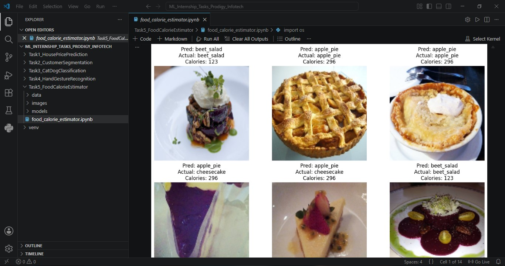

# 🍔 Food Calorie Estimator

An AI-powered Food Recognition and Calorie Estimation system built using Machine Learning and Computer Vision techniques.

The application analyzes food images, identifies the food category, and estimates calorie information based on the predicted food item.

---

## 🚀 Features

- Food image classification
- Calorie estimation
- Image preprocessing and feature extraction
- Machine Learning-based prediction
- Food category detection
- Visual prediction results
- Dataset analysis and model evaluation

---

## 🛠️ Tech Stack

- Python
- OpenCV
- NumPy
- Pandas
- Matplotlib
- Scikit-Learn
- Jupyter Notebook

---

## 📂 Project Structure

```text
Food-Calorie-Estimator
│
├── data/
├── images/
├── models/
├── food_calorie_estimator.ipynb
└── README.md
```

---

## 🍽️ Food Categories

The model is trained to recognize the following food classes:

- Apple Pie
- Baklava
- Beet Salad
- Cheesecake
- Cheese Plate

---

## ⚙️ How It Works

1. Load and preprocess food images.
2. Extract image features.
3. Train a Machine Learning classification model.
4. Predict food categories from unseen images.
5. Estimate calorie values based on the identified food item.
6. Display predictions and calorie information.

---

## 📊 Sample Output

Example prediction:

Predicted Food : Apple Pie
Estimated Calories : 296 kcal


The system displays:

- Predicted Food Category
- Actual Food Category
- Estimated Calories
- Visual Results

---

## 📸 Project Preview



---

## 🎯 Learning Outcomes

Through this project, I gained practical experience in:

- Computer Vision
- Image Processing
- Feature Extraction
- Machine Learning Classification
- Dataset Handling
- Model Evaluation
- Food Recognition Systems

---

## 🔮 Future Improvements

- Implement Deep Learning (CNNs)
- Improve prediction accuracy
- Support additional food categories
- Real-time food recognition using webcam
- Web application deployment
- Larger and more diverse datasets

---

## 👩‍💻 Author

**Madhura Malap**

GitHub: https://github.com/Madhura-Malap
